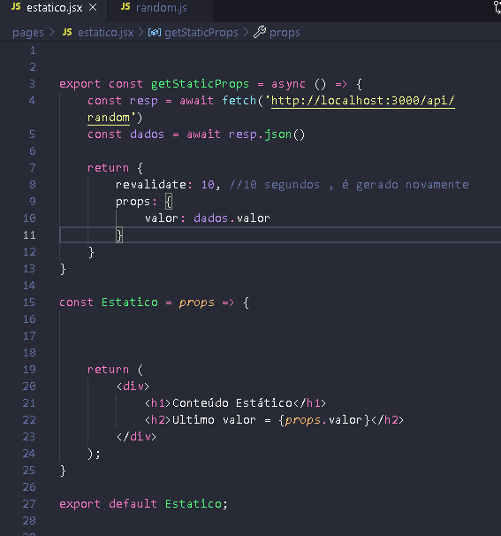

# nextjs-project
Criação de páginas estáticas utilizando next.js.

Páginas estáticas aumentam o desempenho de resposta da sua aplicação na medida em que economiza processamento , diminuindo as requisições feitas no backend da aplicação. Neste projeto utilizo o next.js, devido a facilidade apresentado em comparação com demais Frameworks como o React.

## Projeto

Neste exemplo, é criado uma página estática , onde um componente renderiza um valor localizado em um arquivo JSON (Backend). Esse valor é gerado aleatoriamente e ele é atualizado no arquivo JSON a cada dez segundos.

Um único componente foi criado (componente Estatico). Este renderiza o valor fornecido pelo JSON. Todo o conteudo deste componente é recebido através de props.

